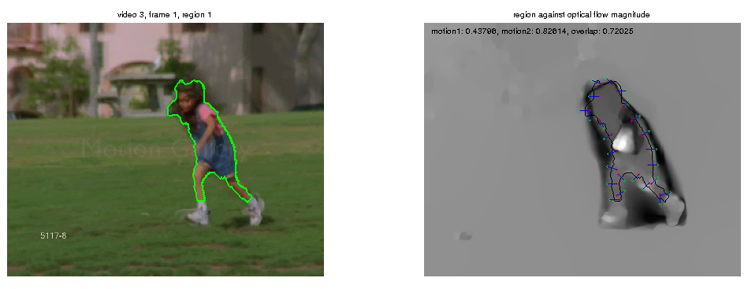

# Object Detection in Video

The **key-segments** [1] approach to video object segmentation, in which objects are automatically extracted from
unlabelled video, uses both static and motion cues to determine the likelihood of a region being an object. Regions
are first detected in static video frames by **Endres's region detector** [2], then evaluated based on their apparent degree
of motion. The current approach adds a new motion cue, which makes a small improvement on the existing motion
cue in its ability to predict the overlap of a region with the ground truth.

Additionally, linear and nonlinear regression analysis was performed to attempt to learn better ways to combine the
static and motion cues.

The program is written in MatLab.

[1] Y. J. Lee, J. Kim, and K. Grauman, Key-Segments for Video Object Segmentation, in ICCV 2011.  
[2] I. Endres and D. Hoiem, Category Independent Object Proposals, in ECCV 2010.  

## Report

The final report is available [here](https://drive.google.com/open?id=0B-CHxEeXdpp2SEFIbm53R1NFZ3M).

## Pipeline

The main pipeline includes:

* Get scores and add to each video's scores subfolder (scores.mat)
* Gather all the scores together into one matrix (saved as scoresAll.mat)
* Generate boxplots for the top 50 scores of each ranking method, including regression

To execute the code:

    > getScores
    > gatherScores
    > compareScores

## Files

The following files are found in the `src` directory:

File | Description
---- | ----
getAppMotionRegionScores.m | yjlee's code, modified to add second motion cue
getMotionCue1.m | code for the first motion cue
getMotionCue2.m | code for the new motion cue
getRegressionLinear.m | called by compareScores
getRegressionNonlinear.m | called by compareScores - calls libsvm
|
showMotionCue.m | generates figures showing how the motion cues work
findExamples.m | find good examples to compare the motion cues
showRegion.m | show a single region by calling showMotionCue
showStaticScores.m | shows a plot of endres static scores
|
getImageType.m | determines the type of image in a folder, eg jpg, png
selectRows.m | selects rows from a matrix
motionRegion.m | work started on extracting regions based on motion
|
scoresAll.mat | data generated for segtrack videos, can be run through compareScores

## Libsvm

Libsvm should be downloaded and put into the `util` subfolder.

Version 3.1 of the Matlab interface is only compiled for 32-bit Linux, so the
nonlinear regression won't work on 64-bit machines, unless you compile it for it.

## License

GPL
